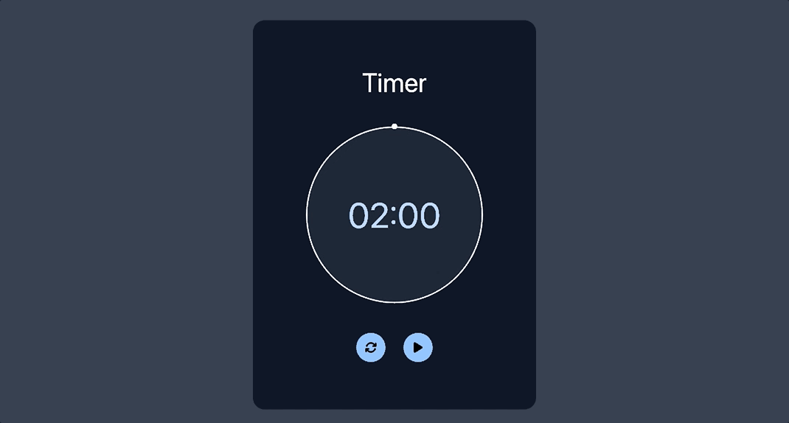

# ⏱ SimpleTimer

A sleek and intuitive **Simple Timer** built with **HTML**, **CSS**, and **JavaScript**.  
Effortlessly switch between countdown and stopwatch modes, with optional desktop notifications for alerts. ⏳🔔

---

## 🎥 Demo

<p align="center">
  
</p>

---

## ✨ Features

-  Set countdown using minutes & seconds or simple input fields  
-  Use it as a stopwatch by resetting to `0:00`  
-  Receive system notifications when the timer ends  
-  Supports light and dark modes  
-  Lightweight, no frameworks needed — super responsive!

---

## 🛠 Technologies Used

-  **HTML** – structure for timer interface  
-  **CSS** – styling, layout, and light/dark mode  
-  **JavaScript** – timer logic, mode switching, and notifications

---

## 📦 How to Use

1. Clone the repository:
   ```bash
   git clone https://github.com/JehanAB/SimpleTimer.git
